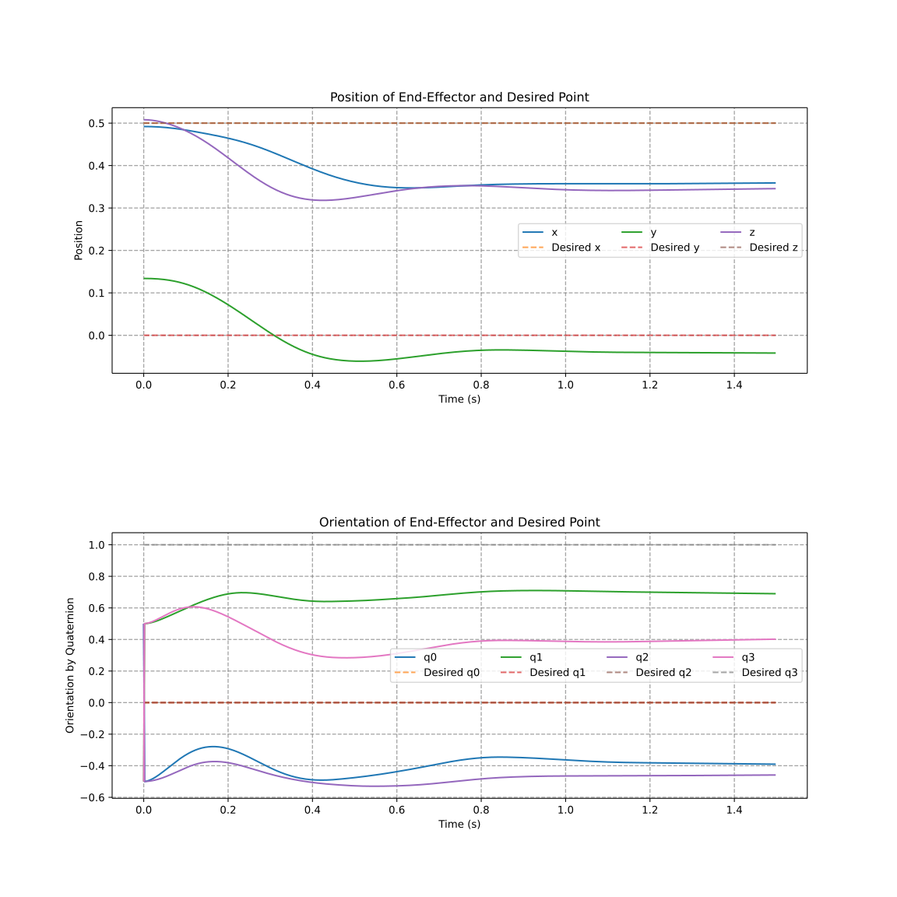
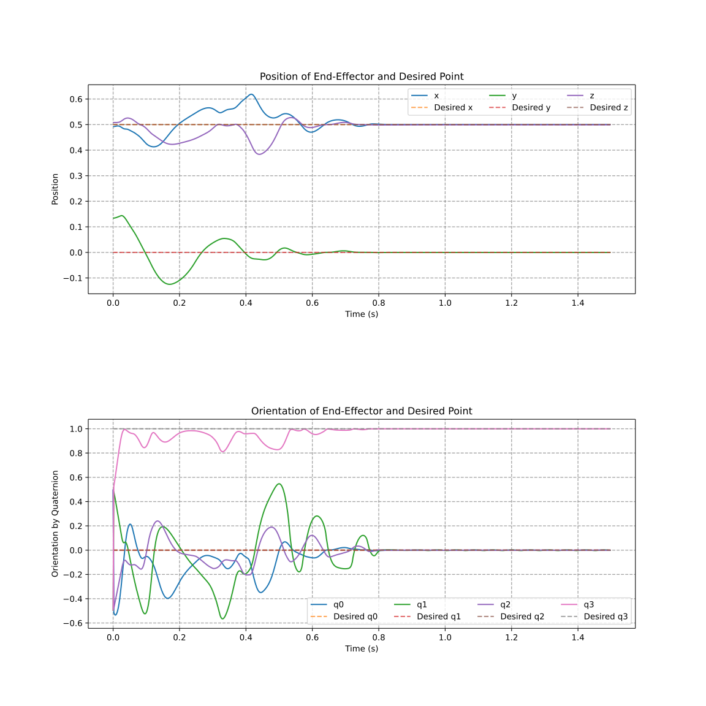
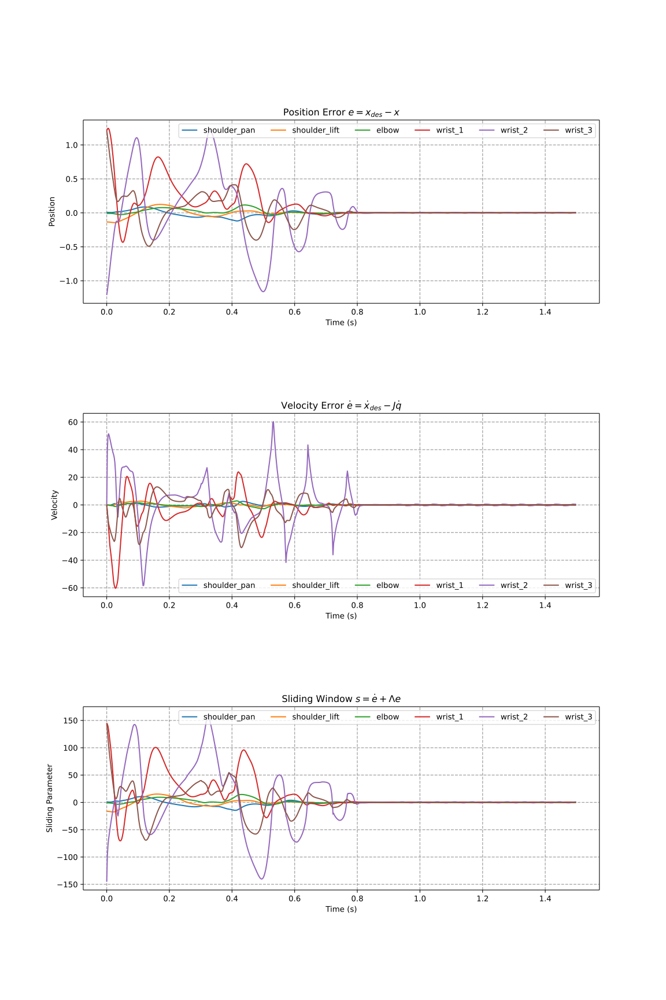
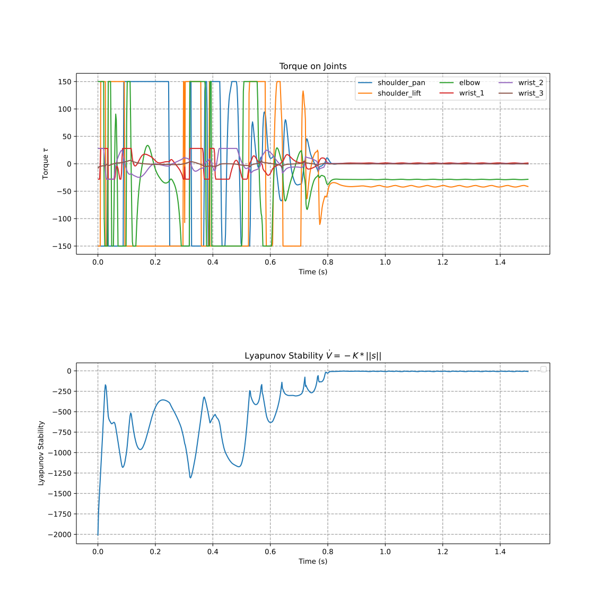

# Robot Control Final

A collection of examples demonstrating robot control and dynamics computation using MuJoCo and Pinocchio.

This template builds upon Kevin Zakka's [MuJoCo Control](https://github.com/kevinzakka/mjctrl/tree/main) repository. The main differences are that it uses [Pinocchio](https://github.com/stack-of-tasks/pinocchio) for robot dynamics computations instead of MuJoCo's built-in engine, supports different actuator types (position, velocity, torque) based on Lev Kozlov's [Actuator Types](https://github.com/lvjonok/mujoco-actuators-types) implementation, and provides a simplified simulation interface to help users focus on control design.

## Setup

Create environment using conda/mamba: 

```bash
conda env create -f env.yml
conda activate forc_hw
```

## Basic Inverse Dynamics Controller

<div style="display: flex; pad: 10px">



</div>

## Sliding Mode Controller

<div style="display: flex; pad: 10px">




</div>


## Interaction with Viewer

To apply disturbances or move the site for the task space controller:

1. `Double click` - Select the body you want to interact with
2. Hold `Ctrl` + mouse buttons:
   - `Left mouse` - Change orientation/apply torque
   - `Right mouse` - Change position/apply force


## Notes

- Videos are saved in `logs/videos/`
- Plots are saved in `logs/plots/`
- The simulator supports both real-time visualization and headless operation
- All examples use the UR5e robot model

The structure of the repository is as follows:
```bash
├── logs/
│ ├── videos/ # Simulation recordings
│ └── plots/ # Generated plots
├── robots/ # Robot models
└── simulator/ # Simulator class
```
